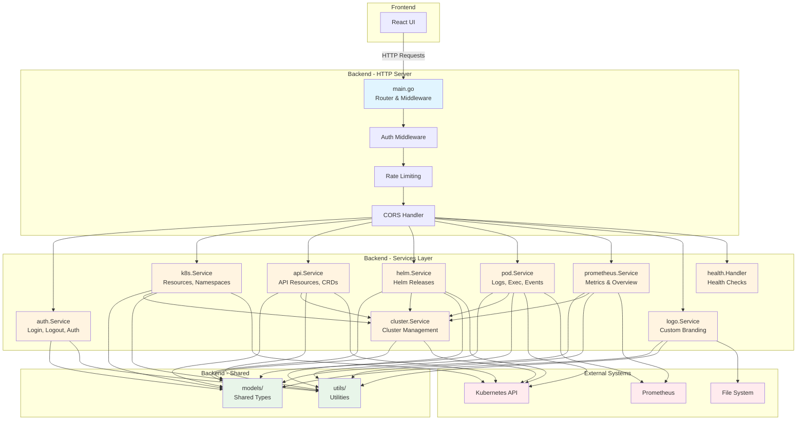

# DKonsole


**DKonsole** is a modern, lightweight Kubernetes dashboard built entirely with **Artificial Intelligence**. It provides an intuitive interface to manage your cluster resources, view logs, execute commands in pods, and monitor historical metrics with Prometheus integration.

## 🤖 Built with AI

This entire project, from backend to frontend and infrastructure code, was generated using advanced AI agents. It demonstrates the power of AI in modern software development.

## ✨ Features

- 🎯 **Resource Management**: View and manage Deployments, Pods, Services, ConfigMaps, Secrets, and more
- 📊 **Prometheus Integration**: Historical metrics for Pods with customizable time ranges (1h, 6h, 12h, 1d, 7d, 15d)
- 📝 **Live Logs**: Stream logs from containers in real-time
- 💻 **Terminal Access**: Execute commands directly in pod containers
- ✏️ **YAML Editor**: Edit resources with a built-in YAML editor
- 🔐 **Secure Authentication**: Argon2 password hashing and JWT-based sessions


## 🚀 Quick Start

### 1. Deploy with Helm

```bash
# Add the repo (if applicable) or clone
git clone https://github.com/flaucha/DKonsole.git
cd DKonsole

# Checkout the latest stable version
git checkout v1.2.5

# EDIT VALUES WITH YOUR FAVORITE EDITOR.
$ vim ./helm/dkonsole/values.yaml

# Install
helm install dkonsole ./helm/dkonsole -n dkonsole --create-namespace
```

## ⚙️ Configuration

The `values.yaml` file is designed to be simple. You only need to configure the essentials:

### 1. Authentication (Required)
You must provide an `admin` username and an Argon2 `passwordHash`. You also need a `jwtSecret` for session security.

```yaml
admin:
  username: admin
  passwordHash: "$argon2id$..." # Generate with argon2 tool
  # RECOMMENDED when using --set: Use passwordHashBase64 to avoid Helm parsing issues
  passwordHashBase64: "" # Base64-encoded hash (takes precedence over passwordHash)
jwtSecret: "..." # Generate with openssl rand -base64 32
```

**Generate password hash:**

### Option A: Using Go (Recommended if installed)
```bash
cd backend && go run ../scripts/generate-password-hash.go "yourpassword"
```

### Option B: Using Docker (No Go required)
```bash
docker run --rm -v $(pwd):/app -w /app/backend golang:1.24-alpine go run ../scripts/generate-password-hash.go "yourpassword"
```

### Option C: Using `argon2` CLI
If you have the `argon2` utility installed (e.g., `apt install argon2` or `brew install argon2`):
```bash
# Usage: echo -n "password" | argon2 "salt" -i -t 3 -m 12 -p 1 -l 32 -e
# Note: -m 12 means 2^12 = 4096 KB
echo -n "yourpassword" | argon2 "$(openssl rand -hex 16)" -i -t 3 -m 12 -p 1 -l 32 -e
```

### Option D: Using Node.js (npm)
If you have Node.js installed, you can use `npx` to run a quick script:
```bash
# This uses the 'argon2' package to generate a compatible hash
npx -y argon2-cli -h "yourpassword" -t 3 -m 12 -p 1 --type argon2i
```

**Using `--set` with Helm (Recommended):**
When using `helm install --set`, Helm interprets commas as list separators, which can break Argon2 hashes containing commas. Use `passwordHashBase64` instead:

```bash
# 1. Generate hash (pick one method)
# Method A (Go):
HASH=$(cd backend && go run ../scripts/generate-password-hash.go "yourpassword")
# Method B (Docker):
HASH=$(docker run --rm -v $(pwd):/app -w /app/backend golang:1.24-alpine go run ../scripts/generate-password-hash.go "yourpassword" | tr -d '\r')
# Method C (Argon2 CLI):
HASH=$(echo -n "yourpassword" | argon2 "$(openssl rand -hex 16)" -i -t 3 -m 12 -p 1 -l 32 -e)
# Method D (npm):
HASH=$(npx -y argon2-cli -h "yourpassword" -t 3 -m 12 -p 1 --type argon2i)

# 2. Encode to base64 (Linux/Mac)
ENCODED=$(echo -n "$HASH" | base64 -w 0)
# Note: On Mac, use 'base64' without '-w 0'. If output has newlines, pipe to 'tr -d "\n"'

# 3. Install with --set (no escaping needed!)
helm install dkonsole ./helm/dkonsole --set admin.passwordHashBase64="$ENCODED"
```

Or use the helper script (requires Go):
```bash
# Generate and encode in one step
cd backend && go run ../scripts/generate-password-hash.go "yourpassword" | xargs ../scripts/encode-hash.sh
```

### 2. Ingress (Required for external access)
Configure your domain and TLS settings to access the dashboard.

```yaml
ingress:
  enabled: true
  className: "nginx"
  annotations:
    cert-manager.io/cluster-issuer: "letsencrypt-prod"
  hosts:
    - host: dkonsole.example.com
      paths:
        - path: /
          pathType: Prefix
  tls:
    - secretName: dkonsole-tls
      hosts:
        - dkonsole.example.com

# Optional: Restrict WebSocket origins (CORS)
allowedOrigins: "https://dkonsole.example.com"
```

### 3. Prometheus Integration (Optional)
Enable historical metrics by configuring your Prometheus endpoint.

```yaml
prometheusUrl: "http://prometheus-server.monitoring.svc.cluster.local:9090"
```

**Features enabled with Prometheus:**
- Historical CPU and memory metrics for Pods
- Time range selector (1 hour, 6 hours, 12 hours, 1 day, 7 days, 15 days)
- Metrics tab in Pod details view

**Note:** If `prometheusUrl` is not configured, the Metrics tab will not be displayed.

### 4. Docker Image (Optional)
By default, it uses the official image. You can change tag or repository if needed.

```yaml
image:
  repository: dkonsole/dkonsole
  tag: "1.2.5"
```

## 🐳 Docker Image

The official image is available at:

- **Unified**: `dkonsole/dkonsole:1.2.5`

**Note:** Starting from v1.1.0, DKonsole uses a unified container architecture where the backend serves the frontend static files. This improves security by reducing the attack surface and eliminating inter-container communication.

## 📝 Changelog

### v1.2.5 (2025-11-26)
**✨ Enhanced Resource Management & UI Improvements**

This release adds comprehensive pod list views, improved navigation, and fixes several UI issues.

- **Deployment Image SHA Display**: Smart image SHA handling with shortened display, hover tooltip, and click-to-copy
- **Pod List Tabs**: Added "Pod List" tabs to Deployment, DaemonSet, and StatefulSet details with navigation to pod details
- **Ingress Service Links**: Display and navigate to services pointed to by ingresses
- **Service Selector Tab**: Added "Selector" tab showing associated pods
- **Job Runs Tab**: Added "Runs" tab listing job pods
- **CronJob Manual Run**: Added manual run button for CronJobs
- **CronJob Status Colors**: Improved status colors (Succeeded=green, Failed=red, others=yellow)
- **YAML Editor Fix**: Fixed duplicate `apiVersion` field issue
- **CronJob Trigger Fix**: Fixed EOF error when triggering CronJobs
- **Action Menu Alignment**: Fixed three-dot menu alignment in all lists

### v1.2.4 (2025-11-26)
**🔧 Helm Chart Password Hash Fix**

This release fixes the "Invalid credentials" error when using `helm install --set` with Argon2 password hashes.

- **Helm Chart Password Hash Parsing**: Fixed hash truncation issue with special characters
  - Added `admin.passwordHashBase64` support to avoid Helm parsing issues
  - Works seamlessly with `--set` without character escaping
  - Maintains backward compatibility with `passwordHash` for `values.yaml`
  - Created helper script `scripts/encode-hash.sh` for easy encoding

### v1.2.3 (2025-11-25)
**🔧 Helm Chart Fixes & Authentication Improvements**

This release fixes critical Helm chart issues and enhances authentication flexibility.

- **Helm Chart PVC Fix**: Fixed PersistentVolumeClaim to properly include `storageClassName` field
- **Argon2 Hash Generation**: Created reliable Go script for generating password hashes compatible with version 1.2.2
- **Flexible Argon2 Support**: Enhanced authentication to accept any valid Argon2 hash format
  - Supports both `argon2id` and `argon2i` variants with any parameters
  - Automatic parameter extraction from hash
  - Fallback support for different base64 encodings
  - Improved error messages and validation

### v1.2.1 (2025-11-24)
**🔒 Security, Testing, Performance & Documentation Improvements**

This release focuses on security hardening, comprehensive testing, performance improvements, and enhanced documentation.

- **Security**: HTTP security headers (Helmet-like), stricter input validation, security tests
- **Testing**: Complete test coverage for authentication, K8s services, and pod exec security
- **Code Quality**: Removed console.logs from production, implemented code splitting
- **Performance**: Prometheus query timeouts, WebSocket connection limits
- **Infrastructure**: Healthcheck in Dockerfile, pinned base image (alpine:3.19)
- **Documentation**: Structured JSON logging, comprehensive Godoc, Swagger/OpenAPI, Architecture Decision Records
- **CI/CD**: Added linting, vulnerability scanning (Trivy, npm audit, govulncheck)
  - All resource detail components moved to `components/details/` directory
  - Improved separation of concerns with dedicated detail components
  - Better code organization and reusability
- **Changed**: Backend architecture cleanup
  - Removed obsolete `GetResources_OLD` function (~760 lines)
  - Removed unused Prometheus helper functions (now handled by `internal/prometheus/` package)
  - Removed unused constants and imports
  - Cleaned up `resources.go` file
- **Removed**: Obsolete components and temporary files
  - Removed deprecated `DeploymentTable.jsx` and `PodTable.jsx` (replaced by unified `WorkloadList.jsx`)
  - Removed duplicate `AcercaDe.jsx` (duplicate of `About.jsx`)
  - Removed example ingress and certificate files
- **New**: Logo Management Module (`internal/logo/`)
  - Separated `UploadLogo` handler into layered architecture (Handler → Service → Storage)
  - Created dedicated `LogoValidator` for file validation and SVG security checks
  - Created `LogoStorage` interface for file persistence abstraction
  - Improved testability and maintainability following Single Responsibility Principle (SRP)
- **Improved**: Dependency Injection Pattern
  - Introduced `ServiceFactory` pattern in `k8s` and `helm` modules
  - Handlers now use injected factories instead of creating services directly
  - Reduced coupling between HTTP handlers and business logic services
  - Better testability with mockable factories
- **Technical**: Code quality improvements
  - Removed ~850+ lines of obsolete code
  - Eliminated code duplication
  - Improved maintainability
  - Applied SOLID principles (SRP, Dependency Inversion)
  - Updated release script to read version from VERSION file

### v1.1.10 (2025-01-27)
**🔒 Security: Dependency Updates**

- Updated: Dependencies updated to address security vulnerabilities
  - Kubernetes client libraries updated from v0.29.0 to v0.34.2
  - JWT library updated to v5.3.0
  - WebSocket library updated to latest version
  - Multiple transitive dependencies updated to secure versions

### v1.1.9 (2025-01-27)
**🔒 Security Fix: Critical RCE Vulnerability**

- Fixed: Critical security vulnerability in `/api/pods/exec` endpoint
  - Endpoint was not protected with authentication middleware
  - Now requires authentication before allowing pod command execution
  - Prevents unauthenticated Remote Code Execution (RCE) attacks
- Fixed: Resource loading issue when switching between sections
  - Resources now load correctly without requiring manual page refresh

### v1.1.8 (2025-11-24)
**🎨 Selector de color para logs con persistencia**

- Added: Selector de color para personalizar el color del texto en los logs
  - Selector visual mejorado con cuadraditos de color seleccionables
  - Opciones disponibles: gris, verde, celeste, amarillo, naranja, blanco
  - Persistencia de selección usando localStorage
  - Diseño más armónico con fondo oscuro y mejor espaciado
  - El color seleccionado se aplica a todos los logs en tiempo real
  - Disponible en todos los visores de logs (LogViewerInline)

For the complete changelog, see [CHANGELOG.md](./CHANGELOG.md)

## 📊 Prometheus Metrics

DKonsole integrates with Prometheus to provide historical metrics visualization. The following PromQL queries are used:

**CPU Usage (millicores):**
```promql
sum(rate(container_cpu_usage_seconds_total{namespace="<namespace>",pod="<pod-name>",container!=""}[5m])) * 1000
```

**Memory Usage (MiB):**
```promql
sum(container_memory_working_set_bytes{namespace="<namespace>",pod="<pod-name>",container!=""}) / 1024 / 1024
```

## 💰 Support the Project

If you find this project useful, consider donating to support development.

**BSC (Binance Smart Chain) Wallet:**
`0x9baf648fa316030e12b15cbc85278fdbd82a7d20`

**Buy me a coffee:**
https://buymeacoffee.com/flaucha

## 📧 Contact

For questions or feedback, please contact: **flaucha@gmail.com**

## 🏗️ Arquitectura

For detailed coding standards and contribution guidelines, please refer to [CODING_GUIDELINES.md](./CODING_GUIDELINES.md).

DKonsole utiliza una arquitectura orientada al dominio en el backend, organizando el código en módulos especializados dentro de `backend/internal/`:



### Módulos del Backend

- **`models/`**: Tipos compartidos y estructuras de datos (Handlers, ClusterConfig, Resource, etc.)
- **`utils/`**: Funciones auxiliares compartidas (manejo de errores, validaciones, contextos)
- **`auth/`**: Autenticación y autorización (JWT, Argon2, middleware)
- **`cluster/`**: Gestión de múltiples clusters Kubernetes
- **`k8s/`**: Operaciones con recursos estándar de Kubernetes (Namespaces, Resources, YAML)
- **`api/`**: Recursos de API genéricos y CRDs (Custom Resource Definitions)
- **`helm/`**: Gestión de releases de Helm
- **`pod/`**: Operaciones específicas de pods (logs, exec, events, métricas)
- **`prometheus/`**: Integración con Prometheus para métricas históricas
- **`logo/`**: Gestión de logos personalizados
- **`health/`**: Endpoints de health check (liveness/readiness)

## 🛠️ Development

To run locally:

```bash
# Backend
cd backend && go run main.go

# Frontend
cd frontend && npm run dev
```

## License

MIT License
