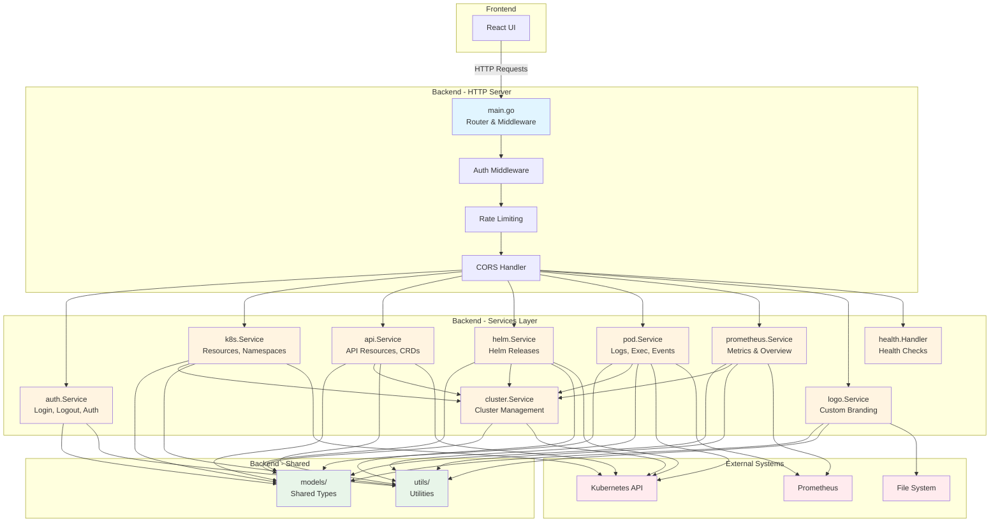

# DKonsole


**DKonsole** is a modern, lightweight Kubernetes dashboard built entirely with **Artificial Intelligence**. It provides an intuitive interface to manage your cluster resources, view logs, execute commands in pods, and monitor historical metrics with Prometheus integration.

## 🤖 Built with AI

This entire project, from backend to frontend and infrastructure code, was generated using advanced AI agents. It demonstrates the power of AI in modern software development.

## ✨ Features

- 🎯 **Resource Management**: View and manage Deployments, Pods, Services, ConfigMaps, Secrets, and more
- 📊 **Prometheus Integration**: Historical metrics for Pods with customizable time ranges (1h, 6h, 12h, 1d, 7d, 15d)
- 📝 **Live Logs**: Stream logs from containers in real-time
- 💻 **Terminal Access**: Execute commands directly in pod containers
- ✏️ **YAML Editor**: Edit resources with a built-in YAML editor
- 🔐 **Secure Authentication**: Argon2 password hashing and JWT-based sessions


## 🚀 Quick Start

### 1. Deploy with Helm

```bash
# Add the repo (if applicable) or clone
git clone https://github.com/flaucha/DKonsole.git
cd DKonsole

# Checkout the latest stable version
git checkout v1.2.8

# Configure ingress and allowedOrigins (at minimum)
vim ./helm/dkonsole/values.yaml

# Install
helm install dkonsole ./helm/dkonsole -n dkonsole --create-namespace

# After installation, access the web interface to complete the initial setup
```

## ⚙️ Configuration

The `values.yaml` file is designed to be simple. You only need to configure the essentials:

### 1. Ingress (Required for external access)
Configure your domain and TLS settings to access the dashboard.

```yaml
ingress:
  enabled: true
  className: "nginx"
  annotations:
    cert-manager.io/cluster-issuer: "letsencrypt-prod"
  hosts:
    - host: dkonsole.example.com
      paths:
        - path: /
          pathType: Prefix
  tls:
    - secretName: dkonsole-tls
      hosts:
        - dkonsole.example.com

# Required for setup mode via ingress (CORS)
allowedOrigins: "https://dkonsole.example.com"
```

### 2. Initial Setup (Web Interface)
After deploying the Helm chart, access the web interface to complete the initial setup:

1. **Deploy the chart** (no authentication configuration needed):
   ```bash
   helm install dkonsole ./helm/dkonsole -n dkonsole --create-namespace
   ```

2. **Access the web interface** via your ingress URL

3. **Complete the setup form**:
   - Enter admin username
   - Enter admin password (minimum 8 characters)
   - Optionally set a JWT secret (or leave empty for auto-generation)
   - Click "Complete Setup"

4. **Login** with the credentials you configured

The setup creates a Kubernetes secret (`{release-name}-auth`) automatically with:
- Admin username
- Argon2-hashed password
- JWT secret for session security

**Note:** The secret is created automatically by the application. You don't need to configure authentication in Helm values.

### 3. Prometheus Integration (Optional)
Enable historical metrics by configuring your Prometheus endpoint.

```yaml
prometheusUrl: "http://prometheus-server.monitoring.svc.cluster.local:9090"
```

**Features enabled with Prometheus:**
- Historical CPU and memory metrics for Pods
- Time range selector (1 hour, 6 hours, 12 hours, 1 day, 7 days, 15 days)
- Metrics tab in Pod details view

**Note:** If `prometheusUrl` is not configured, the Metrics tab will not be displayed.

### 4. Docker Image (Optional)
By default, it uses the official image. You can change tag or repository if needed.

```yaml
image:
  repository: dkonsole/dkonsole
  tag: "1.2.8"
```

## 🐳 Docker Image

The official image is available at:

- **Unified**: `dkonsole/dkonsole:1.2.8`

**Note:** Starting from v1.1.0, DKonsole uses a unified container architecture where the backend serves the frontend static files. This improves security by reducing the attack surface and eliminating inter-container communication.

## 📝 Changelog

### v1.2.8 (2025-11-29)
**✨ Settings Management & Metrics Fixes**

This release adds settings management and fixes Prometheus metrics functionality.

- **Settings Module**: New settings management system for application configuration
  - Prometheus URL configuration via web interface
  - Password change functionality with confirmation dialog
  - Settings stored in Kubernetes ConfigMap for persistence
  - Dynamic Prometheus service updates without restart
- **Favicon Size**: Increased favicon size from 120x120 to 512x512 for better visibility
- **Password Change UX**: Improved password change flow with confirmation popup
  - Shows warning about automatic logout
  - Requires explicit confirmation before changing password
  - Automatic logout and redirect to login after password change
- **Prometheus Metrics Fix**: Fixed metrics not working after URL update
  - Added thread-safe URL updates with mutex protection
  - Prometheus service now updates dynamically when URL changes
  - ConfigMap is read at startup to load saved Prometheus URL

### v1.2.7 (2025-11-28)
**✨ Setup Mode & Auto-Reload**

This release introduces a web-based setup mode for initial configuration and automatic service reload.

- **Setup Mode**: Initial setup via web interface instead of Helm secrets
  - Automatic detection when `dkonsole-auth` secret doesn't exist
  - Web-based setup form for admin username, password, and JWT secret
  - Auto-generation of JWT secret with manual override option
  - Argon2 password hashing for secure credential storage
- **Auto-Reload After Setup**: Service automatically reloads configuration after setup completion
  - No pod restart required after initial setup
  - Seamless transition from setup mode to normal operation
- **Setup Status Check**: Frontend checks setup status on page load
  - Shows "Setup Completed" message if setup already done
  - Prevents duplicate setup attempts
  - Automatic redirect to login after successful setup
- **Security**: Passwords are now hashed using Argon2id with secure random salt generation

### v1.2.6 (2025-11-27)
**✨ UI Enhancements & Logo Fixes**

This release adds success notifications, service DNS display, and fixes logo loading consistency.

- **CronJob Trigger Success Popup**: Added success notification when manually triggering a CronJob with link to job details
- **Service DNS Display**: Added DNS information to Service details with click-to-copy functionality
- **Build Script Auto-Commit**: Build script now automatically commits and pushes changes before building
- **Logo Loading Fix**: Fixed logo display consistency between login and main page
  - Login page now uses same logo as main page (custom or default)
  - GET endpoint for `/api/logo` is now public (no authentication required)
  - Added timestamp to logo URL to prevent browser caching

### v1.2.5 (2025-11-26)
**✨ Enhanced Resource Management & UI Improvements**

This release adds comprehensive pod list views, improved navigation, and fixes several UI issues.

- **Deployment Image SHA Display**: Smart image SHA handling with shortened display, hover tooltip, and click-to-copy
- **Pod List Tabs**: Added "Pod List" tabs to Deployment, DaemonSet, and StatefulSet details with navigation to pod details
- **Ingress Service Links**: Display and navigate to services pointed to by ingresses
- **Service Selector Tab**: Added "Selector" tab showing associated pods
- **Job Runs Tab**: Added "Runs" tab listing job pods
- **CronJob Manual Run**: Added manual run button for CronJobs
- **CronJob Status Colors**: Improved status colors (Succeeded=green, Failed=red, others=yellow)
- **YAML Editor Fix**: Fixed duplicate `apiVersion` field issue
- **CronJob Trigger Fix**: Fixed EOF error when triggering CronJobs
- **Action Menu Alignment**: Fixed three-dot menu alignment in all lists

For the complete changelog, see [CHANGELOG.md](./CHANGELOG.md)

## 📊 Prometheus Metrics

DKonsole integrates with Prometheus to provide historical metrics visualization. The following PromQL queries are used:

**CPU Usage (millicores):**
```promql
sum(rate(container_cpu_usage_seconds_total{namespace="<namespace>",pod="<pod-name>",container!=""}[5m])) * 1000
```

**Memory Usage (MiB):**
```promql
sum(container_memory_working_set_bytes{namespace="<namespace>",pod="<pod-name>",container!=""}) / 1024 / 1024
```

## 💰 Support the Project

If you find this project useful, consider donating to support development.

**BSC (Binance Smart Chain) Wallet:**
`0x9baf648fa316030e12b15cbc85278fdbd82a7d20`

**Buy me a coffee:**
https://buymeacoffee.com/flaucha

## 📧 Contact

For questions or feedback, please contact: **flaucha@gmail.com**

## 🏗️ Arquitectura

For detailed coding standards and contribution guidelines, please refer to [CODING_GUIDELINES.md](./CODING_GUIDELINES.md).

DKonsole utiliza una arquitectura orientada al dominio en el backend, organizando el código en módulos especializados dentro de `backend/internal/`:



### Módulos del Backend

- **`models/`**: Tipos compartidos y estructuras de datos (Handlers, ClusterConfig, Resource, etc.)
- **`utils/`**: Funciones auxiliares compartidas (manejo de errores, validaciones, contextos)
- **`auth/`**: Autenticación y autorización (JWT, Argon2, middleware)
- **`cluster/`**: Gestión de múltiples clusters Kubernetes
- **`k8s/`**: Operaciones con recursos estándar de Kubernetes (Namespaces, Resources, YAML)
- **`api/`**: Recursos de API genéricos y CRDs (Custom Resource Definitions)
- **`helm/`**: Gestión de releases de Helm
- **`pod/`**: Operaciones específicas de pods (logs, exec, events, métricas)
- **`prometheus/`**: Integración con Prometheus para métricas históricas
- **`logo/`**: Gestión de logos personalizados
- **`health/`**: Endpoints de health check (liveness/readiness)

## 🛠️ Development

To run locally:

```bash
# Backend
cd backend && go run main.go

# Frontend
cd frontend && npm run dev
```

## License

MIT License
