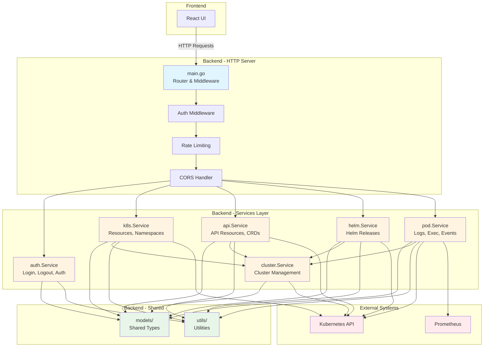

# DKonsole


**DKonsole** is a modern, lightweight Kubernetes dashboard built entirely with **Artificial Intelligence**. It provides an intuitive interface to manage your cluster resources, view logs, execute commands in pods, and monitor historical metrics with Prometheus integration.

## 🤖 Built with AI

This entire project, from backend to frontend and infrastructure code, was generated using advanced AI agents. It demonstrates the power of AI in modern software development.

## ✨ Features

- 🎯 **Resource Management**: View and manage Deployments, Pods, Services, ConfigMaps, Secrets, and more
- 📊 **Prometheus Integration**: Historical metrics for Pods with customizable time ranges (1h, 6h, 12h, 1d, 7d, 15d)
- 📝 **Live Logs**: Stream logs from containers in real-time
- 💻 **Terminal Access**: Execute commands directly in pod containers
- ✏️ **YAML Editor**: Edit resources with a built-in YAML editor
- 🔐 **Secure Authentication**: Argon2 password hashing and JWT-based sessions
- 🌐 **Multi-Cluster Support**: Manage multiple Kubernetes clusters from a single interface

## 🚀 Quick Start

### 1. Deploy with Helm

```bash
# Add the repo (if applicable) or clone
git clone https://github.com/flaucha/DKonsole.git
cd DKonsole

# Checkout the latest stable version
git checkout v1.1.9

# Install
helm install dkonsole ./helm/dkonsole -n dkonsole --create-namespace
```

## ⚙️ Configuration

The `values.yaml` file is designed to be simple. You only need to configure the essentials:

### 1. Authentication (Required)
You must provide an `admin` username and an Argon2 `passwordHash`. You also need a `jwtSecret` for session security.

```yaml
admin:
  username: admin
  passwordHash: "$argon2id$..." # Generate with argon2 tool
jwtSecret: "..." # Generate with openssl rand -base64 32
```

**Generate password hash:**
```bash
echo -n "yourpassword" | argon2 $(openssl rand -base64 16) -id -t 3 -m 12 -p 1 -l 32 -e
```

### 2. Ingress (Required for external access)
Configure your domain and TLS settings to access the dashboard.

```yaml
ingress:
  enabled: true
  className: "nginx"
  annotations:
    cert-manager.io/cluster-issuer: "letsencrypt-prod"
  hosts:
    - host: dkonsole.example.com
      paths:
        - path: /
          pathType: Prefix
  tls:
    - secretName: dkonsole-tls
      hosts:
        - dkonsole.example.com

# Optional: Restrict WebSocket origins (CORS)
allowedOrigins: "https://dkonsole.example.com"
```

### 3. Prometheus Integration (Optional)
Enable historical metrics by configuring your Prometheus endpoint.

```yaml
prometheusUrl: "http://prometheus-server.monitoring.svc.cluster.local:9090"
```

**Features enabled with Prometheus:**
- Historical CPU and memory metrics for Pods
- Time range selector (1 hour, 6 hours, 12 hours, 1 day, 7 days, 15 days)
- Metrics tab in Pod details view

**Note:** If `prometheusUrl` is not configured, the Metrics tab will not be displayed.

### 4. Docker Image (Optional)
By default, it uses the official image. You can change tag or repository if needed.

```yaml
image:
  repository: dkonsole/dkonsole
  tag: "1.1.9"
```

## 🐳 Docker Image

The official image is available at:

- **Unified**: `dkonsole/dkonsole:1.1.9`

**Note:** Starting from v1.1.0, DKonsole uses a unified container architecture where the backend serves the frontend static files. This improves security by reducing the attack surface and eliminating inter-container communication.

## 📝 Changelog

### v1.1.9 (2025-01-27)
**🔒 Security Fix: Critical RCE Vulnerability**

- Fixed: Critical security vulnerability in `/api/pods/exec` endpoint
  - Endpoint was not protected with authentication middleware
  - Now requires authentication before allowing pod command execution
  - Prevents unauthenticated Remote Code Execution (RCE) attacks

### v1.1.8 (2025-11-24)
**🎨 Selector de color para logs con persistencia**

- Added: Selector de color para personalizar el color del texto en los logs
  - Selector visual mejorado con cuadraditos de color seleccionables
  - Opciones disponibles: gris, verde, celeste, amarillo, naranja, blanco
  - Persistencia de selección usando localStorage
  - Diseño más armónico con fondo oscuro y mejor espaciado
  - El color seleccionado se aplica a todos los logs en tiempo real
  - Disponible en todos los visores de logs (LogViewerInline)

### v1.1.7 (2025-01-26)
**🔧 Hotfix: Settings UI Improvements**

- Fixed: Moved About section to Settings tab for better navigation
- Added: General tab with Languages placeholder

### v1.1.6 (2025-01-26)
**🧪 Testing Infrastructure & CI/CD**

- ✅ **Testing Framework Setup**: Complete testing infrastructure for both frontend and backend
  - Vitest configured with React Testing Library for frontend
  - Go testing framework configured for backend
  - Test setup files and utilities created
- ✅ **Unit Tests**: Comprehensive test suite added
  - Frontend: 23 tests across 5 test files (dateUtils, resourceParser, statusBadge, expandableRow, k8sApi)
  - Backend: Multiple tests for utils and models packages
- ✅ **CI/CD Pipeline**: GitHub Actions workflow configured
  - Automated testing on push to `main` branch
  - Automated testing on Pull Requests
  - Coverage reports generated for both frontend and backend
  - Build verification step included
- ✅ **Testing Scripts**: Automation scripts for easy testing
  - `test-all.sh`: Run all tests with a single command
  - `scripts/test-frontend.sh`: Frontend testing script
  - `scripts/test-backend.sh`: Backend testing script
  - `scripts/test-backend-docker.sh`: Docker-based backend testing alternative
- ✅ **CI Optimization**: Workflow excludes documentation and script changes to reduce unnecessary runs

### v1.1.4 (2025-01-24)
**🎨 UI Refactor & Bug Fixes**

- ✅ **Consistent List Style**: Unified styling across WorkloadList, NamespaceManager, and HelmChartManager
- ✅ **Resource Delete Menu**: Restored three-dot menu with Delete and Force Delete options
- ✅ **API Endpoint Fixes**: Fixed 404 errors and endpoint mismatches
- ✅ **Empty State Display**: Fixed blank screens when no resources exist
- ✅ **Edit YAML Button**: Fixed non-functional Edit YAML in WorkloadList
- ✅ **Expanded Details Styling**: Enhanced visual design with better contrast and spacing
- ✅ **Log Viewer**: Improved scroll behavior for smoother experience
- ✅ **Error Handling**: Better error propagation and messages

### v1.1.3 (2025-01-23)
**🚀 Helm Charts Manager & UI Enhancements**

- ✅ **Helm Charts Manager**: Complete Helm release management interface
- ✅ **Pod Events & Timeline**: New events tab in pod details
- ✅ **UI State Persistence**: Browser remembers selected namespace and current view
- ✅ **Responsive Tables**: Scroll horizontal when window is narrow
- ✅ **Pod Table Enhancements**: Added Ready and Restarts columns
- ✅ **PVC Enhancements**: Added Size column with sorting
- ✅ **Date Formatting**: Standardized across all components

### v1.1.2 (2025-01-23)
**✨ Resource Quota Manager Improvements**

- ✅ **Namespace Selector**: Added namespace filter with All/Selected toggle
- ✅ **Automatic Refresh**: Resources refresh automatically after operations
- ✅ **UI Consistency**: Reorganized layout to match other pages
- ✅ **Menu Simplification**: Streamlined to Edit YAML and Delete only
- ✅ **YAML Editor Fix**: Now uses kubectl apply (Server-Side Apply)
- ✅ **Create Menu**: Changed from hover to click interaction
- ✅ **Template Namespace**: New resources use selected namespace
- ✅ **Color Consistency**: Removed colorful elements for gray-scale design

For the complete changelog, see [CHANGELOG.md](./CHANGELOG.md)

## 📊 Prometheus Metrics

DKonsole integrates with Prometheus to provide historical metrics visualization. The following PromQL queries are used:

**CPU Usage (millicores):**
```promql
sum(rate(container_cpu_usage_seconds_total{namespace="<namespace>",pod="<pod-name>",container!=""}[5m])) * 1000
```

**Memory Usage (MiB):**
```promql
sum(container_memory_working_set_bytes{namespace="<namespace>",pod="<pod-name>",container!=""}) / 1024 / 1024
```

## 💰 Support the Project

If you find this project useful, consider donating to support development.

**BSC (Binance Smart Chain) Wallet:**
`0x9baf648fa316030e12b15cbc85278fdbd82a7d20`

**Buy me a coffee:**
https://buymeacoffee.com/flaucha

## 📧 Contact

For questions or feedback, please contact: **flaucha@gmail.com**

## 🏗️ Arquitectura

DKonsole utiliza una arquitectura orientada al dominio en el backend, organizando el código en módulos especializados dentro de `backend/internal/`:



### Módulos del Backend

- **`models/`**: Tipos compartidos y estructuras de datos (Handlers, ClusterConfig, Resource, etc.)
- **`utils/`**: Funciones auxiliares compartidas (manejo de errores, validaciones, contextos)
- **`auth/`**: Autenticación y autorización (JWT, Argon2, middleware)
- **`cluster/`**: Gestión de múltiples clusters Kubernetes
- **`k8s/`**: Operaciones con recursos estándar de Kubernetes (Namespaces, Resources, YAML)
- **`api/`**: Recursos de API genéricos y CRDs (Custom Resource Definitions)
- **`helm/`**: Gestión de releases de Helm
- **`pod/`**: Operaciones específicas de pods (logs, exec, events, métricas)

## 🛠️ Development

To run locally:

```bash
# Backend
cd backend && go run main.go

# Frontend
cd frontend && npm run dev
```

## License

MIT License
