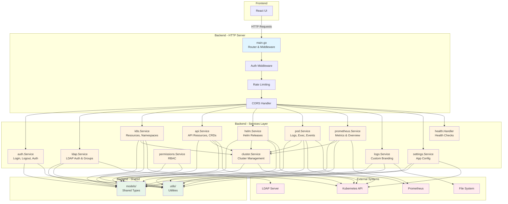

# DKonsole 


**DKonsole** is a modern, lightweight Kubernetes dashboard built with **Artificial Intelligence**. It provides an intuitive interface to manage your cluster resources, view logs, execute commands in pods, and monitor historical metrics with Prometheus integration.


---


## 🤖 Built with AI

Almost all this project, from backend to frontend and infrastructure code, was generated using advanced AI agents. It demonstrates the power of AI in modern software development.

## ✨ Features

- 🎯 **Resource Management**: View and manage Deployments, Pods, Services, ConfigMaps, Secrets, and more
- 📊 **Prometheus Integration**: Historical metrics for Pods with customizable time ranges (1h, 6h, 12h, 1d, 7d, 15d)
- 📝 **Live Logs**: Stream logs from containers in real-time
- 💻 **Terminal Access**: Execute commands directly in pod containers
- ✏️ **YAML Editor**: Edit resources with a built-in YAML editor
- 🔐 **Secure Authentication**: Argon2 password hashing and JWT-based sessions
- 📱 **LDAP Integration**: LDAP Integration for user authentication

## 🚀 Quick Start

### 1. Apply the Single Manifest

```bash
# Latest stable manifest install
kubectl apply -f https://raw.githubusercontent.com/flaucha/DKonsole/v1.6.0/deploy/dkonsole.yaml

# Access locally
kubectl -n dkonsole port-forward svc/dkonsole 8080:8080
```

### 2. Optional Ingress via `DKONSOLE_DOMAIN`

If `DKONSOLE_DOMAIN` is defined, the renderer appends an `Ingress` and configures `ALLOWED_ORIGINS` for that host.

```bash
export DKONSOLE_DOMAIN=dkonsole.example.com

bash <(curl -fsSL https://raw.githubusercontent.com/flaucha/DKonsole/v1.6.0/scripts/render-manifest.sh) \
  https://raw.githubusercontent.com/flaucha/DKonsole/v1.6.0/deploy/dkonsole.yaml \
  | kubectl apply -f -
```

Optional environment variables for the renderer:

- `DKONSOLE_INGRESS_CLASS`: defaults to `nginx`
- `DKONSOLE_ORIGIN_SCHEME`: defaults to `https`

## ⚙️ Configuration

### 1. Initial Setup (Web Interface)
After applying the manifest, access the web interface to complete the initial setup:

1. **Deploy the manifest** (no authentication configuration needed):
   ```bash
   kubectl apply -f https://raw.githubusercontent.com/flaucha/DKonsole/v1.6.0/deploy/dkonsole.yaml
   ```

2. **Access the web interface** via port-forward or your ingress URL

3. **Create a Kubernetes ServiceAccount token** and paste it into the setup form:
   ```bash
   kubectl -n dkonsole create serviceaccount dkonsole-admin

   kubectl create clusterrolebinding dkonsole-admin \
     --clusterrole=cluster-admin \
     --serviceaccount=dkonsole:dkonsole-admin

   kubectl -n dkonsole create token dkonsole-admin
   ```

   For Kubernetes versions without `kubectl create token`, you can generate a long-lived token with a Secret:
   ```bash
   kubectl -n dkonsole apply -f - <<'EOF'
   apiVersion: v1
   kind: Secret
   metadata:
     name: dkonsole-admin-token
     annotations:
       kubernetes.io/service-account.name: dkonsole-admin
   type: kubernetes.io/service-account-token
   EOF

   kubectl -n dkonsole get secret dkonsole-admin-token -o jsonpath='{.data.token}' | base64 -d && echo
   ```

4. **Complete the setup form**:
   - Enter admin username
   - Enter admin password (minimum 8 characters)
   - Paste the ServiceAccount token generated above
   - Optionally set a JWT secret (or leave empty for auto-generation)
   - Click "Complete Setup"

5. **Login** with the credentials you configured

The setup creates a Kubernetes secret (`{release-name}-auth`) automatically with:
- Admin username
- Argon2-hashed password
- JWT secret for session security

**Note:** The secret is created automatically by the application. You don't need to pre-create authentication data.

### 3. Prometheus Integration (Optional)
Enable historical metrics by adding `PROMETHEUS_URL` to the Deployment environment.

```yaml
- name: PROMETHEUS_URL
  value: "http://prometheus-server.monitoring.svc.cluster.local:9090"
```

**Features enabled with Prometheus:**
- Historical CPU and memory metrics for Pods
- Time range selector (1 hour, 6 hours, 12 hours, 1 day, 7 days, 15 days)
- Metrics tab in Pod details view

**Note:** If `PROMETHEUS_URL` is not configured, the Metrics tab will not be displayed.

### 4. Security

#### Dependency Scanning

Este proyecto utiliza escaneo automatizado de vulnerabilidades:

- **Trivy**: Escaneo de contenedores y filesystems
- **govulncheck**: Análisis específico de Go
- **npm audit**: Vulnerabilidades de Node.js

##### Ejecutar manualmente

```bash
# Backend (Go)
cd backend
govulncheck ./...

# Frontend (npm)
cd frontend
npm audit --audit-level=high

# Container
docker build -t dkonsole:test .
trivy image dkonsole:test
```


### 5. Manifest Details

The single manifest installs:

- Namespace `dkonsole`
- Deployment `dkonsole`
- ClusterIP Service `dkonsole`
- Optional Ingress when `DKONSOLE_DOMAIN` is provided to the renderer

If you need to customize the image manually, edit the manifest before applying it:

```yaml
image: dkonsole/dkonsole:1.6.0
```

## 🐳 Docker Image

The official image is available at:

- **Unified**: `dkonsole/dkonsole:1.6.0`

## 📝 Changelog

### v1.6.0 (2026-03-22)
**Single Manifest Install**

- **Deployment**: Added `deploy/dkonsole.yaml` for direct `kubectl apply` installs.
- **Deployment**: Added `scripts/render-manifest.sh` to append an Ingress when `DKONSOLE_DOMAIN` is set.
- **Docs**: Switched the primary installation guide from Helm to the single-manifest workflow.

### v1.5.7 (2026-03-22)
**Trivy Workflow Fix**

- **CI/Trivy**: Replaced `aquasecurity/trivy-action` wrapper usage in filesystem/config scans with direct Trivy CLI Docker invocations after GitHub Actions produced invalid SARIF for clean scans.
- **Release/Pipeline**: Cut a follow-up patch release so the tag pipeline runs with the corrected workflow definitions.

### v1.5.6 (2026-03-22)
**Security Scanner Fixes**

- **Frontend/Security**: Added npm overrides for `dompurify` and `flatted` and regenerated the lockfile so GitHub Actions `npm audit` passes again.
- **Helm/Security**: Hardened the default container security context and mounted a writable `/tmp` volume so Trivy no longer flags the chart for missing `readOnlyRootFilesystem`.
- **CI/Runtime Security**: Bumped Go/toolchain pins to `1.25.8`, moved Trivy actions off `@master`, and updated the runtime image to Alpine `3.22`.

For the complete changelog, see [CHANGELOG.md](./CHANGELOG.md)

## 📊 Prometheus Metrics

DKonsole integrates with Prometheus to provide historical metrics visualization. The following PromQL queries are used:

**CPU Usage (millicores):**
```promql
sum(rate(container_cpu_usage_seconds_total{namespace="<namespace>",pod="<pod-name>",container!=""}[5m])) * 1000
```

**Memory Usage (MiB):**
```promql
sum(container_memory_working_set_bytes{namespace="<namespace>",pod="<pod-name>",container!=""}) / 1024 / 1024
```

## 💰 Support the Project

If you find this project useful, consider donating to support development.

**Buy me a coffee:**
https://buymeacoffee.com/flaucha

## 📧 Contact

For questions or feedback, please contact: **flaucha@gmail.com**

## 🏗️ Arquitectura

For detailed coding standards and contribution guidelines, please refer to [CODING_GUIDELINES.md](./CODING_GUIDELINES.md).

DKonsole utiliza una arquitectura orientada al dominio en el backend, organizando el código en módulos especializados dentro de `backend/internal/`:


```mermaid
graph TB
    subgraph "Frontend"
        UI[React UI]
    end

    subgraph "Backend - HTTP Server"
        Main[main.go<br/>Router & Middleware]
        AuthMW[Auth Middleware]
        RateLimit[Rate Limiting]
        CORS[CORS Handler]
    end

    subgraph "Backend - Services Layer"
        AuthSvc[auth.Service<br/>Login, Logout, Auth]
        LdapSvc[ldap.Service<br/>LDAP Auth & Groups]
        ClusterSvc[cluster.Service<br/>Cluster Management]
        K8sSvc[k8s.Service<br/>Resources, Namespaces]
        ApiSvc[api.Service<br/>API Resources, CRDs]
        HelmSvc[helm.Service<br/>Helm Releases]
        PodSvc[pod.Service<br/>Logs, Exec, Events]
        PromSvc[prometheus.Service<br/>Metrics & Overview]
        LogoSvc[logo.Service<br/>Custom Branding]
        SettingsSvc[settings.Service<br/>App Config]
        HealthSvc[health.Handler<br/>Health Checks]
        PermsSvc[permissions.Service<br/>RBAC]
    end

    subgraph "Backend - Shared"
        Models[models/<br/>Shared Types]
        Utils[utils/<br/>Utilities]
    end

    subgraph "External Systems"
        K8s[Kubernetes API]
        Prometheus[Prometheus]
        FileSystem[File System]
        LDAP[LDAP Server]
    end

    UI -->|HTTP Requests| Main
    Main --> AuthMW
    AuthMW --> RateLimit
    RateLimit --> CORS
    CORS --> AuthSvc
    CORS --> LdapSvc
    CORS --> K8sSvc
    CORS --> ApiSvc
    CORS --> HelmSvc
    CORS --> PodSvc
    CORS --> PromSvc
    CORS --> LogoSvc
    CORS --> SettingsSvc
    CORS --> HealthSvc

    AuthSvc --> Models
    LdapSvc --> Models
    ClusterSvc --> Models
    K8sSvc --> Models
    K8sSvc --> ClusterSvc
    ApiSvc --> Models
    ApiSvc --> ClusterSvc
    HelmSvc --> Models
    HelmSvc --> ClusterSvc
    PodSvc --> Models
    PodSvc --> ClusterSvc
    PromSvc --> Models
    PromSvc --> ClusterSvc
    LogoSvc --> Models
    SettingsSvc --> Models
    PermsSvc --> Models

    K8sSvc --> Utils
    ApiSvc --> Utils
    HelmSvc --> Utils
    PodSvc --> Utils
    AuthSvc --> Utils
    LdapSvc --> Utils
    PromSvc --> Utils
    LogoSvc --> Utils
    SettingsSvc --> Utils
    PermsSvc --> Utils

    ClusterSvc --> K8s
    K8sSvc --> K8s
    ApiSvc --> K8s
    HelmSvc --> K8s
    PodSvc --> K8s
    PodSvc --> Prometheus
    PromSvc --> Prometheus
    LogoSvc --> FileSystem
    LdapSvc --> LDAP
    SettingsSvc --> K8s

    style Main fill:#e1f5ff
    style AuthSvc fill:#fff4e1
    style LdapSvc fill:#fff4e1
    style ClusterSvc fill:#fff4e1
    style K8sSvc fill:#fff4e1
    style ApiSvc fill:#fff4e1
    style HelmSvc fill:#fff4e1
    style PodSvc fill:#fff4e1
    style PromSvc fill:#fff4e1
    style LogoSvc fill:#fff4e1
    style SettingsSvc fill:#fff4e1
    style HealthSvc fill:#fff4e1
    style PermsSvc fill:#fff4e1
    style Models fill:#e8f5e9
    style Utils fill:#e8f5e9
    style K8s fill:#ffebee
    style Prometheus fill:#ffebee
    style FileSystem fill:#ffebee
    style LDAP fill:#ffebee
```

### Módulos del Backend

- **`models/`**: Tipos compartidos y estructuras de datos (Handlers, ClusterConfig, Resource, etc.)
- **`utils/`**: Funciones auxiliares compartidas (manejo de errores, validaciones, contextos)
- **`auth/`**: Autenticación y autorización (JWT, Argon2, middleware)
- **`ldap/`**: Integración con servidores LDAP para autenticación y grupos
- **`cluster/`**: Gestión de múltiples clusters Kubernetes
- **`k8s/`**: Operaciones con recursos estándar de Kubernetes (Namespaces, Resources, YAML)
- **`api/`**: Recursos de API genéricos y CRDs (Custom Resource Definitions)
- **`helm/`**: Gestión de releases de Helm
- **`pod/`**: Operaciones específicas de pods (logs, exec, events, métricas)
- **`prometheus/`**: Integración con Prometheus para métricas históricas
- **`logo/`**: Gestión de logos personalizados
- **`settings/`**: Gestión de configuración de la aplicación (URL de Prometheus, etc.)
- **`permissions/`**: Servicio de control de acceso basado en roles (RBAC)
- **`health/`**: Endpoints de health check (liveness/readiness)


## License

MIT License
