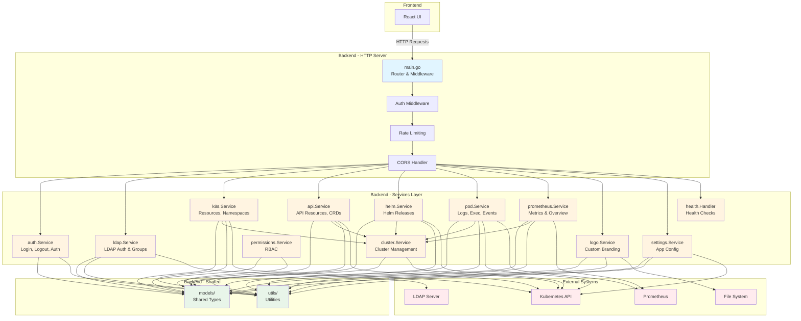

# DKonsole 


**DKonsole** is a modern, lightweight Kubernetes dashboard built with **Artificial Intelligence**. It provides an intuitive interface to manage your cluster resources, view logs, execute commands in pods, and monitor historical metrics with Prometheus integration.


---


## 🤖 Built with AI

Almost all this project, from backend to frontend and infrastructure code, was generated using advanced AI agents. It demonstrates the power of AI in modern software development.

## ✨ Features

- 🎯 **Resource Management**: View and manage Deployments, Pods, Services, ConfigMaps, Secrets, and more
- 📊 **Prometheus Integration**: Historical metrics for Pods with customizable time ranges (1h, 6h, 12h, 1d, 7d, 15d)
- 📝 **Live Logs**: Stream logs from containers in real-time
- 💻 **Terminal Access**: Execute commands directly in pod containers
- ✏️ **YAML Editor**: Edit resources with a built-in YAML editor
- 🔐 **Secure Authentication**: Argon2 password hashing and JWT-based sessions
- 📱 **LDAP Integration**: LDAP Integration for user authentication

## 🚀 Quick Start

### 1. Deploy with Helm

```bash
# Add the repo (if applicable) or clone
git clone https://github.com/flaucha/DKonsole.git
cd DKonsole

# Checkout the latest stable version
git checkout v1.4.10

# Configure ingress and allowedOrigins (at minimum)
vim ./helm/dkonsole/values.yaml

# Install
helm install dkonsole ./helm/dkonsole -n dkonsole --create-namespace

# After installation, access the web interface to complete the initial setup
```

## ⚙️ Configuration

The `values.yaml` file is designed to be simple. You only need to configure the essentials:

### 1. Ingress (Required for external access)
Configure your domain and TLS settings to access the dashboard.

```yaml
ingress:
  enabled: true
  className: "nginx"
  annotations:
    cert-manager.io/cluster-issuer: "letsencrypt-prod"
  hosts:
    - host: dkonsole.lan
      paths:
        - path: /
          pathType: Prefix
  tls:
    - secretName: dkonsole-tls
      hosts:
        - dkonsole.lan

# Required for setup mode via ingress (CORS)
allowedOrigins: "https://dkonsole.lan"
```

### 2. Initial Setup (Web Interface)
After deploying the Helm chart, access the web interface to complete the initial setup:

1. **Deploy the chart** (no authentication configuration needed):
   ```bash
   helm install dkonsole ./helm/dkonsole -n dkonsole --create-namespace
   ```

2. **Access the web interface** via your ingress URL

3. **Complete the setup form**:
   - Enter admin username
   - Enter admin password (minimum 8 characters)
   - Optionally set a JWT secret (or leave empty for auto-generation)
   - Click "Complete Setup"

4. **Login** with the credentials you configured

The setup creates a Kubernetes secret (`{release-name}-auth`) automatically with:
- Admin username
- Argon2-hashed password
- JWT secret for session security

**Note:** The secret is created automatically by the application. You don't need to configure authentication in Helm values.

### 3. Prometheus Integration (Optional)
Enable historical metrics by configuring your Prometheus endpoint.

```yaml
prometheusUrl: "http://prometheus-server.monitoring.svc.cluster.local:9090"
```

**Features enabled with Prometheus:**
- Historical CPU and memory metrics for Pods
- Time range selector (1 hour, 6 hours, 12 hours, 1 day, 7 days, 15 days)
- Metrics tab in Pod details view

**Note:** If `prometheusUrl` is not configured, the Metrics tab will not be displayed.

### 4. Security

#### Dependency Scanning

Este proyecto utiliza escaneo automatizado de vulnerabilidades:

- **Trivy**: Escaneo de contenedores y filesystems
- **govulncheck**: Análisis específico de Go
- **npm audit**: Vulnerabilidades de Node.js

##### Ejecutar manualmente

```bash
# Backend (Go)
cd backend
govulncheck ./...

# Frontend (npm)
cd frontend
npm audit --audit-level=high

# Container
docker build -t dkonsole:test .
trivy image dkonsole:test
```


### 5. Docker Image (Optional)
By default, it uses the official image. You can change tag or repository if needed.

```yaml
image:
  repository: dkonsole/dkonsole
  tag: "1.4.10"
```

## 🐳 Docker Image

The official image is available at:

- **Unified**: `dkonsole/dkonsole:1.4.10`

## 📝 Changelog

### v1.4.10 (2025-12-11)
**ReplicaSets & UI Enhancements**

- **Added**: Full support for ReplicaSets (list, details, pods).
- **UI**: Shortened image tags with copy-on-click for Deployments and ReplicaSets.
- **Fixed**: Backend linting issues.

### v1.4.9 (2025-12-10)
**🎨 Theme Cleanup, CI Fixes & Backend Refactor**

- **UI**: Removed "Light" and unused themes; only Dark and Cream remain.
- **Login**: Fixed Cream theme background color issue.
- **CI**: Fixed frontend test OOM errors with optimized memory limits & exclusions.
- **Backend**: Massive test coverage increase (100% in k8s) and structural refactoring.

### v1.4.8 (2025-12-08)
**🚀 LDAP Integration & UI Enhancements**

- **LDAP**: Comprehensive integration with auth flow and K8s operations.
- **UI**: Generalized filter placeholders and API Explorer styling updates.
- **Fixes**: Prometheus build errors, Helm service refactoring, and general UI fixes.

### v1.4.5 (2025-12-06)
**🔧 WebSocket stability & appearance refactor**

- **WebSocket**: Replaced null char keep-alive with ping/pong protocol; added auto-reconnection with exponential backoff.
- **Appearance**: Simplified settings with dark/cream toggle, font dropdown, and removed animation type selector.
- **Cream Theme**: Warmer, less bright colors; fixed metric tooltip contrast.

For the complete changelog, see [CHANGELOG.md](./CHANGELOG.md)

## 📊 Prometheus Metrics

DKonsole integrates with Prometheus to provide historical metrics visualization. The following PromQL queries are used:

**CPU Usage (millicores):**
```promql
sum(rate(container_cpu_usage_seconds_total{namespace="<namespace>",pod="<pod-name>",container!=""}[5m])) * 1000
```

**Memory Usage (MiB):**
```promql
sum(container_memory_working_set_bytes{namespace="<namespace>",pod="<pod-name>",container!=""}) / 1024 / 1024
```

## 💰 Support the Project

If you find this project useful, consider donating to support development.

**Buy me a coffee:**
https://buymeacoffee.com/flaucha

## 📧 Contact

For questions or feedback, please contact: **flaucha@gmail.com**

## 🏗️ Arquitectura

For detailed coding standards and contribution guidelines, please refer to [CODING_GUIDELINES.md](./CODING_GUIDELINES.md).

DKonsole utiliza una arquitectura orientada al dominio en el backend, organizando el código en módulos especializados dentro de `backend/internal/`:



### Módulos del Backend

- **`models/`**: Tipos compartidos y estructuras de datos (Handlers, ClusterConfig, Resource, etc.)
- **`utils/`**: Funciones auxiliares compartidas (manejo de errores, validaciones, contextos)
- **`auth/`**: Autenticación y autorización (JWT, Argon2, middleware)
- **`ldap/`**: Integración con servidores LDAP para autenticación y grupos
- **`cluster/`**: Gestión de múltiples clusters Kubernetes
- **`k8s/`**: Operaciones con recursos estándar de Kubernetes (Namespaces, Resources, YAML)
- **`api/`**: Recursos de API genéricos y CRDs (Custom Resource Definitions)
- **`helm/`**: Gestión de releases de Helm
- **`pod/`**: Operaciones específicas de pods (logs, exec, events, métricas)
- **`prometheus/`**: Integración con Prometheus para métricas históricas
- **`logo/`**: Gestión de logos personalizados
- **`settings/`**: Gestión de configuración de la aplicación (URL de Prometheus, etc.)
- **`permissions/`**: Servicio de control de acceso basado en roles (RBAC)
- **`health/`**: Endpoints de health check (liveness/readiness)


## License

MIT License
